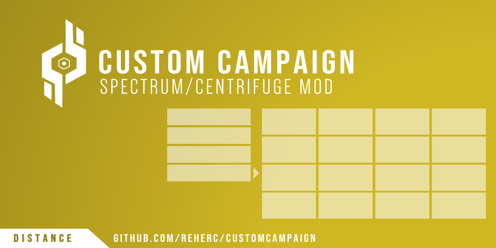

# Custom Campaign
> **Create your own campaigns for Distance using this mod**

# Download the mod
> You can download the mod from the [Releases page](https://github.com/REHERC/CustomCampaign/releases/latest)

# Unstable builds 
> You can download unstable builds from the [AppVeyor artifacts page](https://ci.appveyor.com/project/REHERC/customcampaign/build/artifacts)

# Example campaigns
> You can find example campaign [here](https://drive.google.com/drive/folders/1jT8SzfCGSIh3ttxVWv0EVETN_ZhUeD7W?usp=sharing) to get an idea of how the editor works (use the import button)